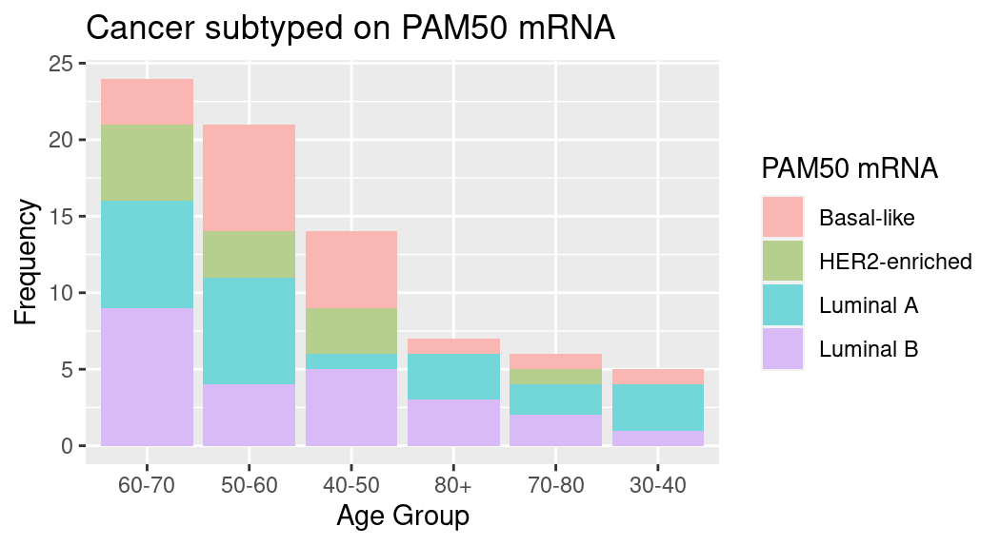

```{r setup, include=FALSE}
knitr::opts_chunk$set(echo = TRUE)
```

## Introduction

**Our dataset**: Breast Cancer Proteomes data from the Clinical Proteomic Tumor Analysis Consortium (NCI/NIH)

**Our aim**: To find meaningful biological insights, just like everybody else! And to have some learnings on the way.

## Materials: know our data

+-----------------------------------------------------------+---------------------+---------------------+
| Dataset name                                              | Observations (rows) | Variables (columns) |
+===========================================================+=====================+=====================+
| Protein expression data                                   | 12553               | 86                  |
|                                                           |                     |                     |
| *iTRAQ proteome profiling from 77 patients*               |                     |                     |
+-----------------------------------------------------------+---------------------+---------------------+
| Clinical data                                             | 105                 | 30                  |
|                                                           |                     |                     |
| *Cancer classification of samples from 77 patients*       |                     |                     |
+-----------------------------------------------------------+---------------------+---------------------+


*Source: [Kaggle](https://www.kaggle.com/datasets/piotrgrabo/breastcancerproteomes)*

## Methods: Cleaning Data
**Cleaning data**: 


## Methods: Augmenting data

## Methods: analysis I

Loads of data cleaning! And it was fun.

Work in progress here!

## Results I

{width="800"}

**PAM50 test** usually categorizes cancer into 5 sub-types. But in our dataset, we found 4 sub-types only and we stuck to it.

## Results II

{width="800"}

-   AJCC staging system: American Joint Committee on Cancer's system to describe the amount and spread of cancer in a patient's body

-   Work in progress here! -- need to rotate the x-axis labels for legibility

    ## Discussion

<!-- -->

-   Work in progress here!
