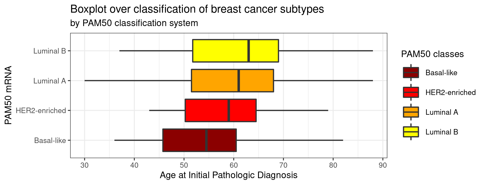

```{r setup, include=FALSE}
knitr::opts_chunk$set(echo = FALSE)
```

## Introduction

**Dataset**:Breast Cancer Proteomes 

1. iTRAQ proteome profiling of 77 breast cancer samples generated by the Clinical Proteomic Tumor Analysis Consortium (NCI/NIH)

2. Expression values for ~12.000 proteins for each sample, with missing values present when a given protein could not be quantified in a given sample

**Source**: https://www.kaggle.com/datasets/piotrgrabo/breastcancerproteomes

## Materials and methods

- PAM50 classification of breast cancer subtypes

{width=500px, height=400px}

## Results

```{r}

```

## Visualization

```{r}

```

## Discussion
```{r}

```


